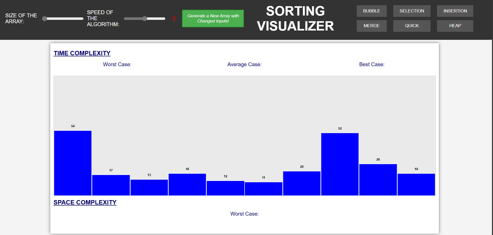

# Sorting Visualizater
This project provides a visualization of various sorting algorithms using HTML, CSS, and JavaScript. The visualizer helps users understand how different sorting algorithms work by displaying the sorting process in an interactive and graphical manner.
# Website Link
https://differentsortingvisualizer.netlify.app/

# Screenshot

Implemented algorithms:
1) Bubble sort
2) Selection sort
3) Insertion sort
4) Merge sort
5) Quick sort
6) Heap sort

# Features

1. Colored Representation of Steps:

Blue: Default state
Yellow: Element being compared
Red: Element identified as in incorrect position and to be moved
Green: Element in correct position

2. Controls for Visualizations:
Speed of Visualization: Five speed levels
Data Size: Adjust the size of the dataset
Generate New Data: Randomly generate new data for sorting
Displays each bar value

3.Complexity Analysis:
Display the time and space complexity of the algorithm being visualized

# Project Structure
The project consists of the following key files:

index.html: Main HTML file that contains the structure of the webpage.
style.css: CSS file for styling the webpage.
main.js: JavaScript file that handles the main functionality and user interactions.
visualizations.js: JavaScript file for rendering the visualizations.
bubble_sort.js: JavaScript implementation of Bubble Sort.
insertion_sort.js: JavaScript implementation of Insertion Sort.
selection_sort.js: JavaScript implementation of Selection Sort.
merge_sort.js: JavaScript implementation of Merge Sort.
quick_sort.js: JavaScript implementation of Quick Sort.
heap_sort.js: JavaScript implementation of Heap Sort.
proj5.png: Image file used in the project. 

# Installation
To set up the project locally, follow these steps:
Clone the repository:
git clone https://github.com/your-username/sorting-visualization.git

Navigate to the project directory:
cd sorting-visualization

Thank you for using the Sorting Visualization Project!

Open the index.html file in your web browser to view the sorting visualizations.

# Usage
1. Visualization Controls: Use the controls provided to adjust the speed, data size, and generate new data for sorting.
2. Algorithm Selection: Select the sorting algorithm you want to visualize from the provided options.
3. Complexity Information: View the time and space complexity information displayed for the selected algorithm.
